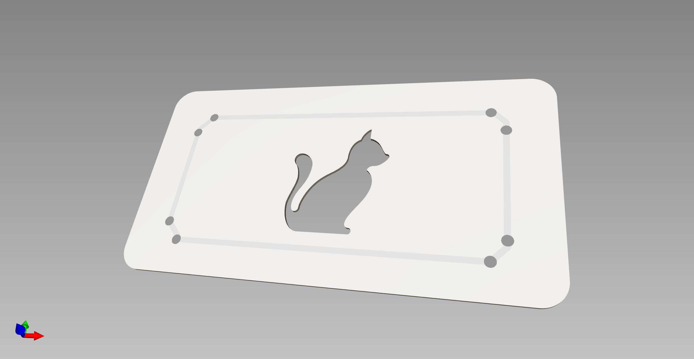
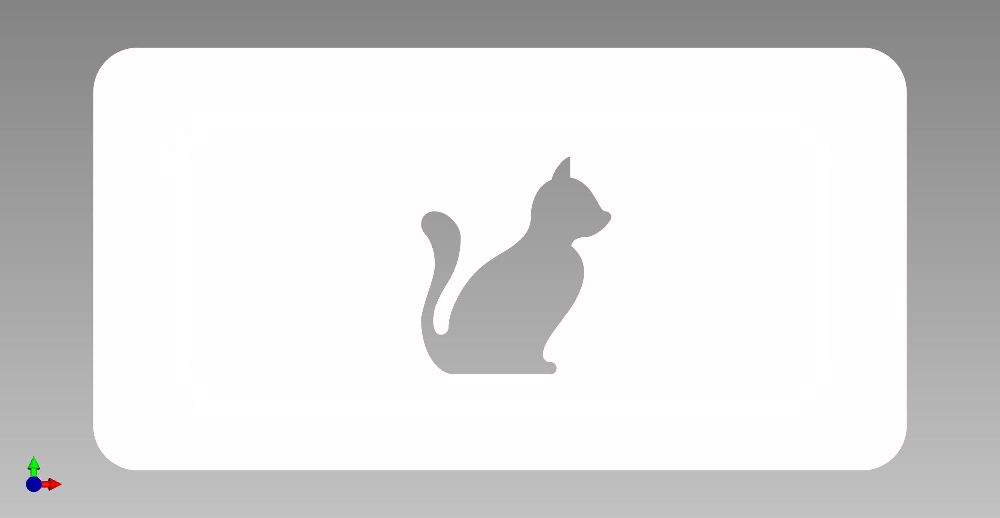
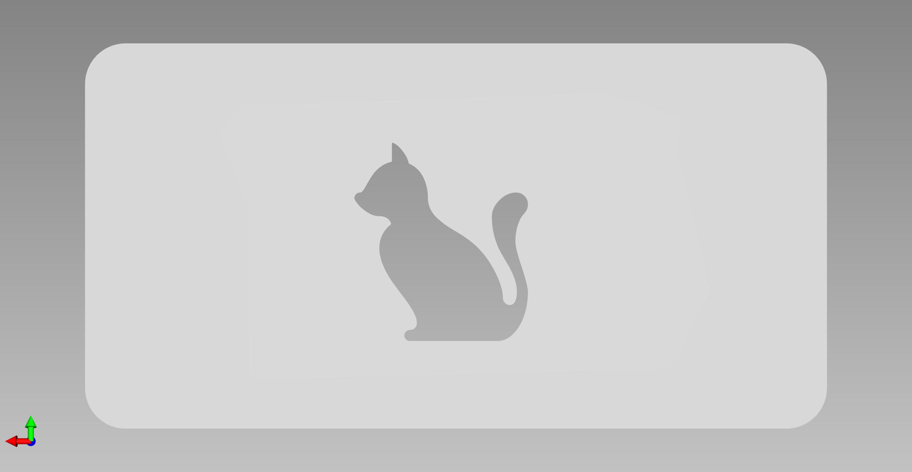

# Aluminum Cover PCB - Cat Edition

This aluminum cover can be easily connected to the main PCB, by just soldering the two pcbs together with the help of the solder points in the corners.

## Links

- [Schematic](https://github.com/glowingkitty/GlowSign/blob/main/AluminumCover%20PCB%20cat%20edition/AluminumCover.pdf)