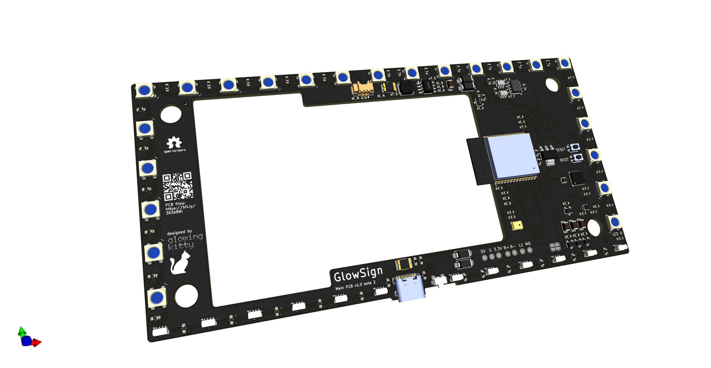
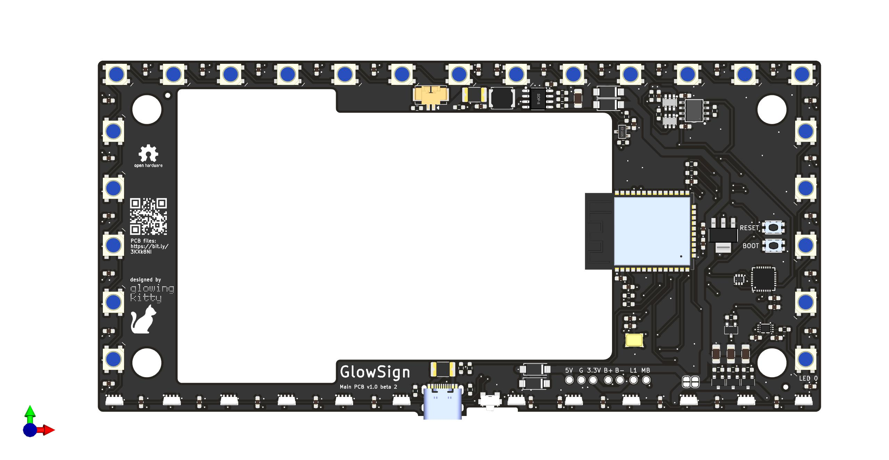
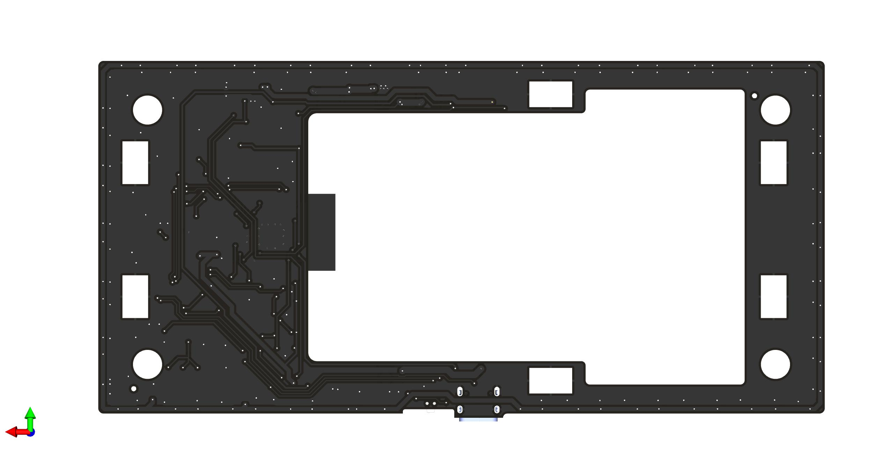

# GlowSign Main PCB

The main PCB for GlowSign. With all the LEDs, the integrated ESP32, a microphone to make the LED animations react to music - and it runs GlowOS (my WLED fork). But you can also upload your own software to the ESP32. The PCB can be powered via USB-C and via a lipo battery.

## Links

- [Schematic](https://github.com/glowingkitty/GlowSign/blob/main/Main%20PCB/GlowSignMainPCB.pdf)
- [Interactive BOM](https://htmlpreview.github.io/?https://github.com/glowingkitty/GlowSign/blob/main/Main%20PCB/bom/ibom.html)
- [PCB stencils](https://github.com/glowingkitty/GlowSign/blob/main/Main%20PCB/PCB%20stencils)